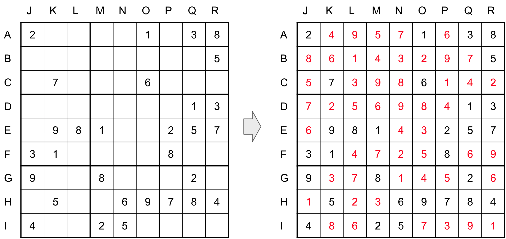

# Sudoku Solver in Haskell

Bird, Richard. Functional pearl: A program to solve sudoku. Journal of functional programming 16.6 (2006): 671-679.  

Paper link: https://www.cs.tufts.edu/~nr/cs257/archive/richard-bird/sudoku.pdf




```
*Main> sudoku ["2....1.38","........5",".7...6...", ".......13", ".981..257", "31....8..", "9..8...2.", ".5..69784", "4..25...."]
[["249571638","861432975","573986142","725698413","698143257","314725869","937814526","152369784","486257391"]]
```